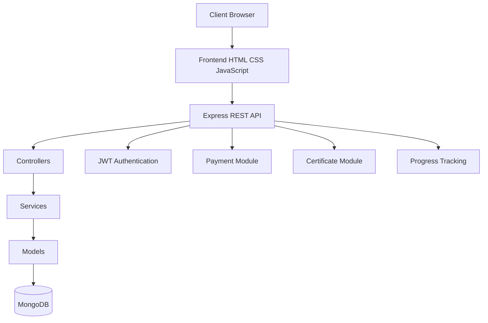
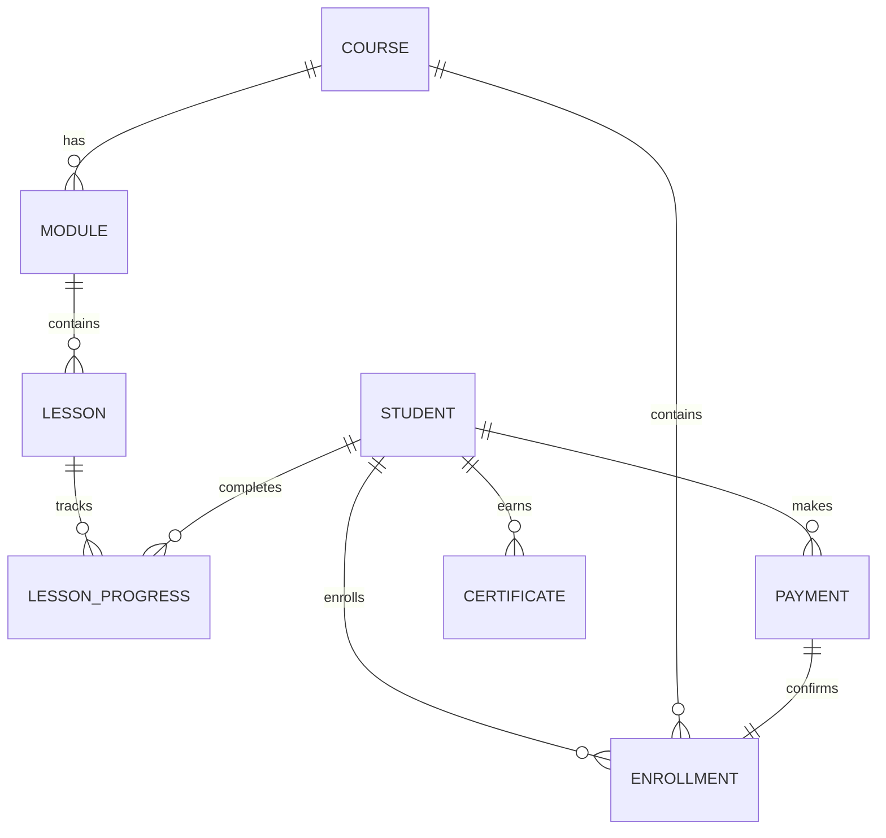
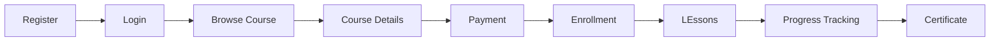

<p align="center">


</p>

<h1 align="center">
🚀 SkillForge LMS
</h1>

<p align="center">

Complete Full Stack Learning Management System

Built with HTML • CSS • JavaScript • Node.js • Express.js • MongoDB

</p>

<p align="center">


</p>

---

# 📖 Table of Contents

- Overview
- Features
- Screenshots
- Technology Stack
- Project Structure
- System Architecture
- Database Design
- API Documentation
- Security Features
- Installation Guide
- Environment Variables
- Project Workflow
- Future Enhancements
- Developer
- License

---

# 📚 Project Overview

SkillForge LMS is a modern Full Stack Learning Management System developed as an integrated project for the Decode Labs Full Stack Development Internship.

The objective of this project is to provide students with a complete online learning platform where they can register, enroll in programming courses, track learning progress, complete lessons, unlock certificates, and manage their learning journey through a clean and responsive dashboard.

The application follows a modular MVC architecture and demonstrates real-world software engineering practices including secure authentication, RESTful APIs, MongoDB database integration, payment workflow, progress tracking, certificate generation, and scalable backend development.

Unlike a simple CRUD application, SkillForge LMS combines frontend, backend, and database technologies into one complete ecosystem capable of handling real user workflows.

---

# 🎯 Project Objectives

- Develop a complete Learning Management System

- Implement Full Stack Architecture

- Design RESTful APIs

- Integrate MongoDB Database

- Secure User Authentication

- Manage Course Enrollments

- Track Student Progress

- Generate Course Certificates

- Demonstrate Clean MVC Architecture

- Follow Professional Development Practices

---

# ✨ Core Features

## 👨‍🎓 Student Module

- Student Registration
- Secure Login
- JWT Authentication
- Profile Management
- Dashboard Access

---

## 📚 Course Management

- Browse Available Courses

- Course Details

- Learning Outcomes

- Modules

- Lessons

- Course Progress

---

## 🎥 Lesson System

- Structured Lessons

- Lesson Completion

- Progress Tracking

- Module Organization

- Learning Status

---

## 📈 Progress Tracking

- Percentage Completion

- Dashboard Statistics

- Lesson Progress

- Course Progress

- Certificate Eligibility

---

## 🏆 Certificate Module

- Automatic Certificate Unlock

- Certificate Generation

- Download Certificate

- Certificate Verification

---

## 💳 Payment System

- Payment Initialization

- Enrollment Verification

- Payment Confirmation

- Enrollment Management

---

## 🔐 Authentication

- Register

- Login

- JWT Token Authentication

- Password Encryption

- Protected Routes

- Authorization Middleware

---

## 📡 REST APIs

- Authentication APIs

- Course APIs

- Lesson APIs

- Progress APIs

- Payment APIs

- Dashboard APIs

- Certificate APIs

- Contact APIs

- Newsletter APIs

- FAQ APIs

- Statistics APIs

---

## ⚙ Backend Features

- Express.js Server

- MVC Architecture

- Service Layer

- Controllers

- Middleware

- Route Separation

- Validation

- Error Handling

- Modular Structure

---

# 🖼️ Application Screenshots

```
screenshots/

home.png

login.png

register.png

dashboard.png

courses.png

course-details.png

payment.png

certificate.png
```

---

## 🏠 Homepage


---

## 🔑 Login


---

## 👤 Registration


---

## 📚 Course Catalogue


---

## 💳 Payment Page


---

## 📈 Student Dashboard


---

## 📖 Course Learning


---


---

# 🛠️ Technology Stack

| Category | Technologies |
|-----------|--------------|
| Frontend | HTML5, CSS3, JavaScript |
| Backend | Node.js |
| Framework | Express.js |
| Database | MongoDB |
| ODM | Mongoose |
| Authentication | JWT |
| Password Security | bcryptjs |
| API Testing | Postman |
| Version Control | Git |
| Repository | GitHub |
| Development Tool | VS Code |

---

# 📂 Project Structure

```text
SkillForge-LMS

│

├── backend/

├── frontend/

├── CHANGELOG.md

├── DEPLOYMENT_NOTES.md

├── README.md

└── .gitignore
```

---

# 📦 Backend Structure

```text
backend/

│

├── config/

├── controllers/

├── middleware/

├── migrations/

├── models/

├── routes/

├── services/

├── validators/

├── utils/

├── docs/

├── seed/

├── data/

├── package.json

├── package-lock.json

├── server.js

└── .env.example
```

---

# 🎨 Frontend Structure

```text
frontend/

│

├── assets/

├── css/

├── js/

├── index.html

├── login.html

├── register.html

├── dashboard.html

├── course.html

└── payment.html
```

---
---

# 🏗️ System Architecture

The application follows a modular MVC (Model–View–Controller) architecture to ensure maintainability, scalability, and separation of concerns.



---

# ⚙️ Backend Architecture

```text
Client

↓

Frontend

↓

REST API

↓

Express Server

↓

Routes

↓

Controllers

↓

Services

↓

Models

↓

MongoDB
```

---

# 🗄️ Database Design

SkillForge LMS uses MongoDB to manage application data through multiple collections.

The database has been designed to maintain data consistency while keeping the architecture modular and scalable.

---

# 📂 Database Collections

| Collection | Purpose |
|------------|---------|
| Students | Store student information |
| Courses | Course Information |
| Modules | Course Modules |
| Lessons | Lesson Details |
| LessonProgress | Lesson Completion |
| Enrollments | Student Enrollment |
| Payments | Payment Records |
| Certificates | Generated Certificates |
| FAQs | Frequently Asked Questions |
| Subscribers | Newsletter Subscribers |
| Testimonials | Student Reviews |
| ContactMessages | Contact Form Messages |

---

# 🗃️ Entity Relationship Diagram



---

# 🔄 Application Workflow



---

# 📡 REST API Documentation

## 🔐 Authentication APIs

| Method | Endpoint | Description |
|---------|----------|-------------|
| POST | /api/auth/register | Register Student |
| POST | /api/auth/login | Student Login |
| POST | /api/auth/logout | Logout Student |

---

## 📚 Course APIs

| Method | Endpoint |
|---------|----------|
| GET | /api/courses |
| GET | /api/courses/:id |

---

## 📖 Lesson APIs

| Method | Endpoint |
|---------|----------|
| GET | /api/lessons |
| GET | /api/lessons/:id |

---

## 📈 Progress APIs

| Method | Endpoint |
|---------|----------|
| GET | /api/progress/dashboard |
| POST | /api/progress/update |

---

## 💳 Payment APIs

| Method | Endpoint |
|---------|----------|
| POST | /api/payments/initiate/:courseId |
| POST | /api/payments/verify |

---

## 🏆 Certificate APIs

| Method | Endpoint |
|---------|----------|
| GET | /api/certificates |

---

## 📊 Statistics APIs

| Method | Endpoint |
|---------|----------|
| GET | /api/stats |

---

## ❓ FAQ APIs

| Method | Endpoint |
|---------|----------|
| GET | /api/faqs |

---

## 📧 Newsletter APIs

| Method | Endpoint |
|---------|----------|
| POST | /api/newsletter |

---

## 📞 Contact APIs

| Method | Endpoint |
|---------|----------|
| POST | /api/contact |

---

# 🔒 Security Features

The project implements multiple security practices to ensure safe and reliable application behavior.

## Authentication

- JSON Web Token (JWT)
- Protected Routes
- Secure Login System

---

## Password Security

- bcryptjs Password Hashing
- Password Comparison
- Secure Storage

---

## API Security

- Authentication Middleware
- Input Validation
- Error Handling Middleware
- Route Protection

---

## Database Security

- Mongoose Schema Validation
- Data Sanitization
- Controlled CRUD Operations

---

## General Security

- Environment Variables
- Modular Codebase
- Clean Error Responses

---

# ⚙️ Installation Guide

## Clone Repository

```bash
git clone https://github.com/Ujjwal26006/Decodelab-task4-Ujjwal.git
```

---

## Move into Backend

```bash
cd Decodelab-task4-Ujjwal/backend
```

---

## Install Dependencies

```bash
npm install
```

---

## Create Environment File

```bash
cp .env.example .env
```

---

## Example Environment Variables

```env
PORT=5000

MONGO_URI=your_mongodb_connection_string

JWT_SECRET=your_secret_key

NODE_ENV=development

CLIENT_URL=http://localhost:5173
```

---

## Start Backend Server

```bash
npm run dev
```

---

## Start Frontend

Open

```text
frontend/index.html
```

using Live Server

OR

Run any local static server.

---

# 📂 Important Files

| File | Purpose |
|------|---------|
| server.js | Application Entry Point |
| package.json | Project Metadata |
| .env.example | Environment Variables |
| README.md | Documentation |
| CHANGELOG.md | Version History |
| DEPLOYMENT_NOTES.md | Deployment Guide |

---

# 📁 Documentation

The repository includes additional project documentation.

- CHANGELOG.md
- DEPLOYMENT_NOTES.md
- backend/docs/API.md
- backend/docs/DATABASE.md

---

---

# 🚀 Future Enhancements

The current version of SkillForge LMS provides a complete learning platform for students. Future releases will focus on improving scalability, collaboration, analytics, and learning experience.

## 👨‍🏫 Instructor Panel

- Create & Manage Courses
- Upload Lessons
- Manage Modules
- Track Student Progress
- View Course Analytics

---

## 🛡️ Admin Dashboard

- Manage Students
- Manage Courses
- Manage Payments
- Manage Certificates
- Manage Testimonials
- Manage FAQs
- Website Analytics

---

## 🎯 Student Features

- Assignment Submission
- Quiz System
- Discussion Forum
- Bookmark Lessons
- Wishlist Courses
- Download Resources

---

## 🤖 AI Features

- AI Course Recommendations
- Smart Learning Suggestions
- AI Study Planner
- Personalized Dashboard

---

## ☁️ Cloud Deployment

- Docker Support
- Nginx Configuration
- Render Deployment
- Vercel Frontend
- MongoDB Atlas
- CI/CD Pipeline

---

## 📧 Communication

- Email Verification
- Password Reset
- OTP Authentication
- Email Notifications
- Course Completion Emails

---

## 📱 Mobile Experience

- Progressive Web App (PWA)
- Android Support
- iOS Support
- Offline Learning

---

# 🚀 Deployment

## Frontend

The frontend can be deployed using:

- GitHub Pages
- Netlify
- Vercel

---

## Backend

The backend can be deployed using:

- Render
- Railway
- DigitalOcean
- AWS EC2

---

## Database

MongoDB Atlas is recommended for production deployment.

---

# 🧪 Testing

The project can be tested using the following tools.

### API Testing

- Postman

### Manual Testing

- Registration
- Login
- Course Enrollment
- Lesson Completion
- Dashboard
- Certificate Generation
- Payment Flow

---

# 📊 Project Highlights

✅ Full Stack Development

✅ MVC Architecture

✅ REST APIs

✅ JWT Authentication

✅ MongoDB Integration

✅ Course Management

✅ Lesson Tracking

✅ Certificate Generation

✅ Payment Integration

✅ Responsive User Interface

✅ Modular Backend

✅ Secure Authentication

---

# 🎯 Why This Project?

SkillForge LMS demonstrates the implementation of a production-inspired Learning Management System using modern web technologies.

The project showcases practical concepts including:

- Clean Architecture
- Modular Backend Design
- Authentication & Authorization
- REST API Development
- Database Design
- MVC Pattern
- Service Layer Architecture
- Payment Workflow
- Certificate Management
- Responsive Frontend

It was developed as a comprehensive project to strengthen Full Stack Development skills while following professional software engineering practices.

---

# 📈 Learning Outcomes

This project helped in gaining practical experience in:

- Frontend Development
- Backend Development
- MongoDB Integration
- Express.js
- Authentication
- API Development
- Project Structure
- Git & GitHub
- Database Design
- Clean Code Principles

---

# 📂 Repository Information

Repository Name

```
Decodelab-task4-Ujjwal
```

Project Name

```
SkillForge LMS
```

Architecture

```
MVC (Model View Controller)
```

Project Type

```
Full Stack Learning Management System
```

---

# 🤝 Contributing

Contributions are welcome.

If you would like to improve this project:

1. Fork the repository

2. Create a new feature branch

3. Commit your changes

4. Push to your branch

5. Open a Pull Request

---

# 📝 Changelog

Project updates are maintained in

```
CHANGELOG.md
```

---

# 📦 Deployment Notes

Deployment documentation is available in

```
DEPLOYMENT_NOTES.md
```

---

# 📚 Additional Documentation

Backend Documentation

```
backend/docs/API.md
```

Database Documentation

```
backend/docs/DATABASE.md
```

---

# 🌐 Live Demo

🚧 Coming Soon

Deployment will be added in future updates.

---

# 🙏 Acknowledgements

Special thanks to

- Decode Labs
- Open Source Community
- Node.js
- Express.js
- MongoDB
- GitHub

for providing the tools and ecosystem that made this project possible.

---

# 📄 License

This project is developed for educational purposes as part of the Decode Labs Full Stack Development Internship.

You are free to explore the code, learn from the implementation, and use it as a reference for educational projects.

---

# ⭐ Support

If you found this project helpful:

⭐ Star this repository

🍴 Fork the repository

📢 Share your feedback

---

<div align="center">

# 🚀 SkillForge LMS

### Complete Full Stack Learning Management System

Built with using

HTML • CSS • JavaScript • Node.js • Express.js • MongoDB

---

**Developed by Ujjwal Garg**

⭐ Thank you for visiting this repository ⭐

</div>
